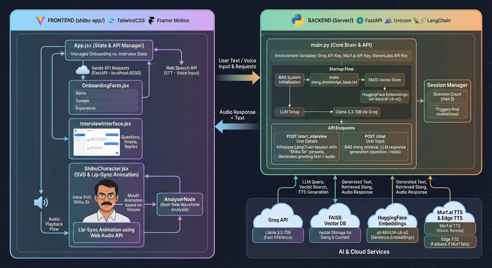

# Shibu Interview Assistant

An AI-powered interview simulation featuring **Shibu Sir**, a strict, highly experienced tech veteran from Kerala who interviews candidates in a unique mix of English and Malayalam ("Manglish").

## 📸 Workflow



## ✨ Features

*   **Personality-Driven AI**: "Shibu Sir" provides roasts, strict feedback, and authentic localized slang using a custom LangChain Persona.
*   **Real-time Lip-Sync**: The frontend analyzes audio waveforms to animate the character's mouth in real-time.
*   **RAG-Powered Slang**: Uses a Retrieval-Augmented Generation (RAG) system with FAISS to inject relevant Malayalam slang into conversations.
*   **High-Quality Voice**: Integrates **Murf.ai** for premium, life-like speech (with EdgeTTS as a robust fallback).
*   **Interactive Frontend**: A beautiful, dark-themed React application with 3D-like character rendering using SVG.

## 🛠️ Tech Stack

### Backend (`Server/`)
*   **Framework**: FastAPI (Python)
*   **AI/LLM**: LangChain, Groq (Llama 3.3 70B)
*   **Vector DB**: FAISS (for slang retrieval)
*   **TTS**: Murf.ai (Primary), EdgeTTS (Fallback)
*   **Audio**: ElevenLabs (Legacy support)

### Frontend (`shibu-app/`)
*   **Framework**: React (Vite)
*   **Styling**: TailwindCSS
*   **Animation**: Framer Motion, Web Audio API (AnalyserNode)
*   **Speech**: Web Speech API (Browser Native)

## 🚀 Setup Instructions

### Prerequisites
*   Python 3.10+
*   Node.js 18+
*   API Keys for **Groq** and **Murf.ai** (optional but recommended)

### 1. Backend Setup
1.  Navigate to the server directory:
    ```bash
    cd Server
    ```
2.  Install dependencies:
    ```bash
    pip install -r requirements.txt
    ```
3.  Create a `.env` file in `Server/` and add your keys:
    ```env
    API_KEY=your_groq_api_key
    MURF_API_KEY=your_murf_api_key
    ```
4.  Run the server:
    ```bash
    uvicorn main:app --reload
    ```
    The server will start at `http://localhost:8000`.

### 2. Frontend Setup
1.  Navigate to the app directory:
    ```bash
    cd shibu-app
    ```
2.  Install dependencies:
    ```bash
    npm install
    ```
3.  Start the development server:
    ```bash
    npm run dev
    ```
    The app will run at `http://localhost:5173`.

## 🎮 How to Play
1.  Open the frontend in your browser.
2.  Fill in your details (Name, Domain, Experience).
3.  Click **"Start Interview"**.
4.  Allow microphone permission.
5.  Answer Shibu Sir's questions. Be prepared for some "Manglish" feedback!
6.  After 5 questions, receive your final score and review.
